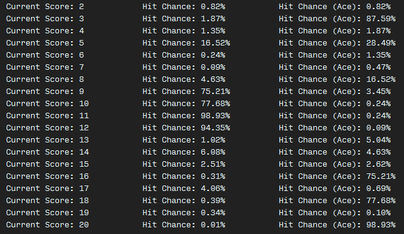

## Genetic Blackjack AI

_Attempts to learn how to play Blackjack genetically._

Each attempt at finding the right balance of weights to learn how to perform a particular is called an **Agent**. A weight is a percentage (0% to 100%) of how likely the Agent is to perform an action in a given situation. For Blackjack, that action is whether or not to *Hit* or *Stand* and the situation is the Agent's score (from 2 to 20). Even if an Agent's weight towards a particular action in a specific context is 95%, he would still have a random 5% chance of deciding to perform the opposite action.

In order to converge on a strategy, many Agents are created with completely random weights towards all possible situations. Each of these Agents are then tested by a **Cost Function**, who evaluates their 'fitness'. In this case, their cost is how much money they lose against the dealer after playing `n` rounds of Blackjack with him. The AI's goal is to get its cost as low as possible, but it is never explicitly told that. Half of the Agent population who had the highest costs are discarded. The remaining Agent population are paired up, reproduce, and **crossover** their respective weights to their children. The children take the places of the discarded Agents. The process begins again and repeats until convergence is achieved.
        
The following is the current convergence of the Agent population over `50` generations.
Each agent played `10000` Blackjack rounds each generation. There was a consistent population of `10000` agents.


```
Generation                   Percentage of money lost to dealer
-------------      --------------        -----------        ------------
Generation #0      Average: 0.322        Best: 0.145        Worst: 0.517     
Generation #1      Average: 0.257        Best: 0.135        Worst: 0.445     
Generation #2      Average: 0.217        Best: 0.112        Worst: 0.389     
Generation #3      Average: 0.194        Best: 0.110        Worst: 0.279     
Generation #4      Average: 0.181        Best: 0.113        Worst: 0.272     
Generation #5      Average: 0.174        Best: 0.116        Worst: 0.237     
Generation #6      Average: 0.169        Best: 0.117        Worst: 0.228     
Generation #7      Average: 0.165        Best: 0.114        Worst: 0.228     
Generation #8      Average: 0.162        Best: 0.109        Worst: 0.219     
Generation #9      Average: 0.159        Best: 0.106        Worst: 0.222     
Generation #10     Average: 0.157        Best: 0.104        Worst: 0.223     
Generation #11     Average: 0.155        Best: 0.106        Worst: 0.215     
Generation #12     Average: 0.154        Best: 0.102        Worst: 0.205     
Generation #13     Average: 0.152        Best: 0.099        Worst: 0.207     
Generation #14     Average: 0.151        Best: 0.099        Worst: 0.207     
Generation #15     Average: 0.150        Best: 0.100        Worst: 0.202     
Generation #16     Average: 0.149        Best: 0.099        Worst: 0.205     
Generation #17     Average: 0.148        Best: 0.102        Worst: 0.204     
Generation #18     Average: 0.147        Best: 0.099        Worst: 0.201     
Generation #19     Average: 0.147        Best: 0.098        Worst: 0.202     
Generation #20     Average: 0.146        Best: 0.102        Worst: 0.199     
Generation #21     Average: 0.145        Best: 0.098        Worst: 0.203     
Generation #22     Average: 0.145        Best: 0.098        Worst: 0.208     
Generation #23     Average: 0.144        Best: 0.099        Worst: 0.204     
Generation #24     Average: 0.144        Best: 0.082        Worst: 0.206     
Generation #25     Average: 0.143        Best: 0.095        Worst: 0.203     
Generation #26     Average: 0.143        Best: 0.099        Worst: 0.202     
Generation #27     Average: 0.143        Best: 0.090        Worst: 0.195     
Generation #28     Average: 0.142        Best: 0.095        Worst: 0.203     
Generation #29     Average: 0.142        Best: 0.084        Worst: 0.204     
Generation #30     Average: 0.142        Best: 0.093        Worst: 0.198     
Generation #31     Average: 0.141        Best: 0.094        Worst: 0.199     
Generation #32     Average: 0.141        Best: 0.085        Worst: 0.209     
Generation #33     Average: 0.141        Best: 0.090        Worst: 0.202     
Generation #34     Average: 0.140        Best: 0.093        Worst: 0.197     
Generation #35     Average: 0.140        Best: 0.091        Worst: 0.197     
Generation #36     Average: 0.140        Best: 0.094        Worst: 0.202     
Generation #37     Average: 0.140        Best: 0.090        Worst: 0.205     
Generation #38     Average: 0.140        Best: 0.092        Worst: 0.196     
Generation #39     Average: 0.139        Best: 0.083        Worst: 0.196     
Generation #40     Average: 0.140        Best: 0.084        Worst: 0.200     
Generation #41     Average: 0.139        Best: 0.092        Worst: 0.202     
Generation #42     Average: 0.139        Best: 0.090        Worst: 0.194     
Generation #43     Average: 0.138        Best: 0.087        Worst: 0.191     
Generation #44     Average: 0.138        Best: 0.086        Worst: 0.196     
Generation #45     Average: 0.139        Best: 0.090        Worst: 0.208     
Generation #46     Average: 0.138        Best: 0.091        Worst: 0.196     
Generation #47     Average: 0.138        Best: 0.087        Worst: 0.196     
Generation #48     Average: 0.138        Best: 0.088        Worst: 0.193     
Generation #49     Average: 0.138        Best: 0.089        Worst: 0.199
```

The Agents converged at around 13.8% of money lost to the dealer. In other words they had an average of `36.2%` chance to win. The best agent in the last generation had an average win-rate of `41.1%`.

##### Generation #49 Convergence - Weights

The left column shows what possible scores an Agent might have at any given time. The middle column determines that percentage chance he would *Hit* in that particular moment. The right column implies the same with the only differing factor being that the Agent is achieving his score with the help of an Ace. Having an Ace may drastically change an Agent's decision making.



Reluctance to *Hit* at very low scores is strange. Stranger still is the interest the Agent has in *Hitting* at Score 20 with an Ace.